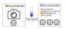

# Low cost (Raspberry-based) particle velocimetry


This package provides a layer abstraction between both 
[Raspberry PiCamera library](https://github.com/waveform80/picamera) 
and [OpenPIV](https://github.com/OpenPIV/openpiv-python) with the 
main goal of running as fast as possible in a Raspberry Pi 4. This package is meant to process the images
as shown in the following image:



We have a main thread that just runs the camera capture process. This is like that due to the 
importance of capturing the frames over processing them in real time. Threads were selected (instead of processes)
because of the shared memory to store the data between producers and consumers (easier to manage).

Once there is any frame captured (thus added to the queue -which plays the role of a pipe in our case-), the consumer
starts to compute the required operations, these operations are (but not limited to):

1. Correct the distortion introduced by the lens.
2. Correct the image perspective introduced by the camera position.
3. Mask the image using computer vision technics (with morphological operations).
4. Compute the particle velocimetry using the OpenPIV library.

---
# Installation
> _Installation expects you to use raspbian._ 

Before starting, we need to enable legacy mode of the Raspberry: run `sudo raspi-config` and then select 
`Interface options > Legacy Camera > Enable`. Then reboot to make the changes effective.

Package is not yet available in the PyPi, but it can be installed from GitHub. Firstly, we need to install some 
dependencies (OpenCV-related):
```bash
sudo apt update && sudo apt upgrade
sudo apt install python3-opencv libatlas-base-dev git
```
Once installed the dependencies, we can install the package (will install also the package python dependencies):
```bash
git clone git@github.com:valcarce01/lcpv.git
cd lcpv
pip install .
```

A basic test execution can be:
```python
from lcpv.lcpv import LCPV
l = LCPV()
l.start(window_size=32, search_area_size=32, overlap=16)
```

Further examples can be found in the `examples` folder.

## Run it with docker

First, ensure you have docker installed:
```bash
curl -sSL https://get.docker.com | sh
sudo usermod -aG docker ${USER}
sudo systemctl --now enable docker
```

And now start the container
```bash
docker build --tag lcpv .
docker run -it -rm --name LCPV lcpv \
  --resolution (1920,1080) --framerate 24 --seconds 1 \
  --camera_params src/camera_calibration_/parameters.json \
  --window_size 32 --search_area_size 32 --overlap 16
```

# Benchmarks

Time measured (in seconds) for random images within ranges [0, 255].

| Resolution   | opening_filter | median_filter | correct_lens_distortion | correct_image_perspective |
|:-------------|---------------:|--------------:|------------------------:|--------------------------:|
| (540, 480)   |           0.01 |          0.03 |                    0.01 |                     0.003 |
| (720, 576)   |           0.01 |          0.05 |                    0.02 |                     0.007 |
| (1280, 720)  |           0.04 |          0.13 |                    0.06 |                      0.01 |
| (1920, 1080) |           0.09 |          0.29 |                    0.13 |                      0.02 |
| (2048, 1536) |           0.13 |          0.46 |                    0.26 |                      0.04 |
| (2592, 1920) |           0.22 |          0.72 |                   0.424 |                      0.07 |
| (3840, 2160) |           0.36 |          1.35 |                    1.11 |                      0.11 |